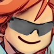

# Radeline

Chaos monkey that optimizes a [Celeste TAS](https://github.com/ShootMe/CelesteTAS) by randomly (or sequentially) changing inputs. Progress for the main game is [here](https://github.com/Kataiser/radeline/projects/1) and results go [here](https://github.com/Kataiser/CelesteTAS/tree/radeline-results) (but I've stopped working on it).

Now includes a fully working movement simulator, for brute forcing precise position and/or speed values! Not at all related to the main program cause that's not confusing!

## Instructions
1. Install Python >= 3.6 (with pip and "Add python to environment variables" checked)
1. Change `KeyStart` in `Saves\modsettings-CelesteTAS.celeste` to `- OemMinus`, because I couldn't get the default bind to work
1. Make sure the inputs in your TAS have a breakpoint on the very last line, a console load (or chapter restart) at the beginning, and end on the chapter complete screen (or a S&Q). The goal is to make the game save to debug.celeste
1. If you're not using the `console load` start method, make sure the most recently run command in Celeste is the correct chapter load (ex. `load 4` or `rmx2 7`)
1. Take a look at `settings.yaml` (it's just a text file) and make sure it's configured like you want. The main thing is putting in the path to your TAS file
1. Be careful with Celeste Studio because it doesn't read Radeline's changes to your TAS and so you could easily accidentally overwrite it. Also make sure "Launch Studio at boot" is enabled in CelesteTAS, in case the game crashes
1. (Optional, super pointless honestly) Install [Cython](https://pypi.org/project/Cython/) and run `build.bat`
1. Run `run.bat`

## Movement sim instructions
1. Install Python >= 3.6 (with pip and "Add python to environment variables" checked)
1. (Optional but very recommended) Install [Cython](https://pypi.org/project/Cython/) and run `build.bat`
1. Run `install.bat`
1. After running the last frame of unsimulated input, use Ctrl-Shift-C in Studio to copy your position and speed and edit `config.yaml` accordingly
1. Make all the other changes to the config you need in order to match your game state, including finding the number of frames to simulate
1. "Permutations" refers to the number of inputs to simulate. This increases run time, especially with more frames, but raises your chances of getting better inputs. 500k to 1m is often good
1. Run `run.bat`, your results will also be saved in `results.txt`
1. An auto-formatter will be started afterwards which lets you copy some resulting inputs to have them be automatically reformatted in your clipboard to be pastable into Studio, which can also be launched with `run formatter.bat` 

If you need any assistance or additional functionality, DM me on Discord at Kataiser#4640

## Why the name?
Because it's a little dumb and almost insulting to real TASers, but dangit if it isn't really cool sometimes (also, Random Madeline). I kind of regret the name and just call it "my optimization script" half the time though. Maybe this repo will be expanded at some point.
